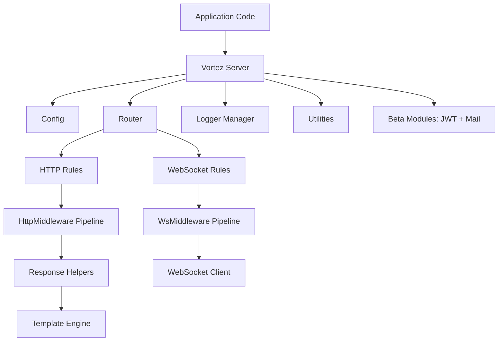
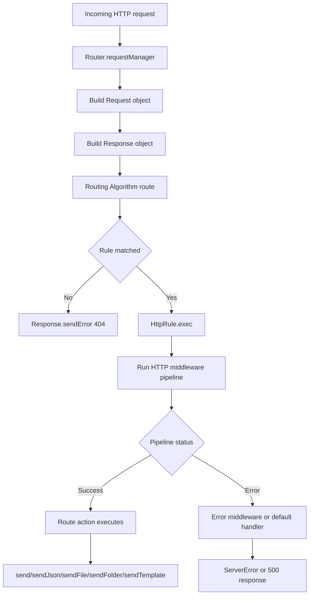
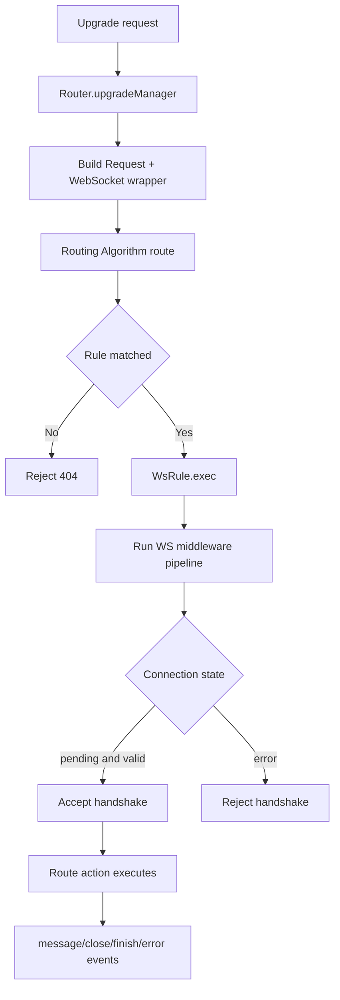
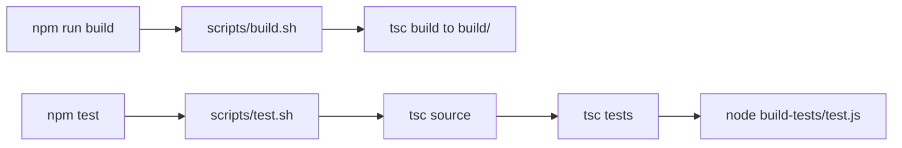

# Vortez Architecture Guide

This document explains how Vortez works internally, how requests are processed end-to-end, and how teams can run it confidently in production.

## Who This Is For

- Engineers evaluating Vortez for backend and real-time workloads.
- Teams onboarding to an existing Vortez codebase.
- Contributors who need to understand extension points and runtime behavior.

## System At A Glance

## Request Lifecycle (HTTP)

### Key behavior

- Route parameters are extracted before action execution.
- Middleware is snapshot-based at rule registration time.
- If no route matches, Vortez returns a 404 error page.
- File and folder responses include path-safety checks for traversal protection.

## Request Lifecycle (WebSocket)

### Key behavior

- WS routes also support middleware and error middleware.
- If middleware completes and state is pending, handshake is auto-accepted.
- Errors before accept are converted into explicit handshake rejection.

## Routing Strategies

- FIFO
  - First matching rule wins.
  - Predictable registration-order behavior.
  - Good default for simple APIs and deterministic route priority.
- Tree
  - Segment-based navigation through static, param, and wildcard nodes.
  - Better scalability for large route maps.
  - Falls back to rule test checks in optional-edge cases.

## Configuration Model

Configuration is schema-driven and normalized on startup.

- Host, port, SSL
- Routing algorithm selection
- Templates for folder and error pages
- Logging controls per channel

This gives stable defaults while preserving explicit overrides.

## Static Files And Templates

- `sendFile` supports byte-range requests for media and binary responses.
- `sendFolder` resolves paths inside a secured base directory.
- `sendTemplate` uses Vortez template compilation with variable and block expansion.

## Build And Test Pipeline

## Operational Checklist For Production

- Use HTTPS with valid key/certificate and explicit TLS termination strategy.
- Configure reverse proxy headers if deploying behind load balancers.
- Register global middleware before route registration.
- Choose `Tree` algorithm for large route sets.
- Define custom error and folder templates for consistent UX.
- Enable structured log persistence and shipping to your observability stack.
- Add health/readiness endpoints and graceful shutdown handling.
- Run CI for compile + tests on every change.

## Recommended Documentation Map

To match industry-grade developer experience, keep docs split by user intent:

- Getting Started: first server in 5 minutes.
- Core Concepts: routing, middleware, request/response.
- Production Guide: deployment, scaling, reliability.
- Security Guide: SSL, headers, path safety, secrets.
- API Reference: exported classes and methods.
- Examples: REST API, static site, SPA/PWA, WebSocket chat.

This architecture guide is the canonical high-level reference for that set.